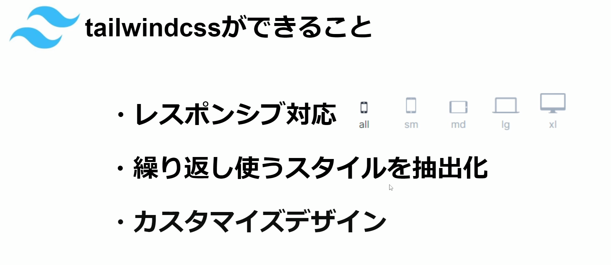
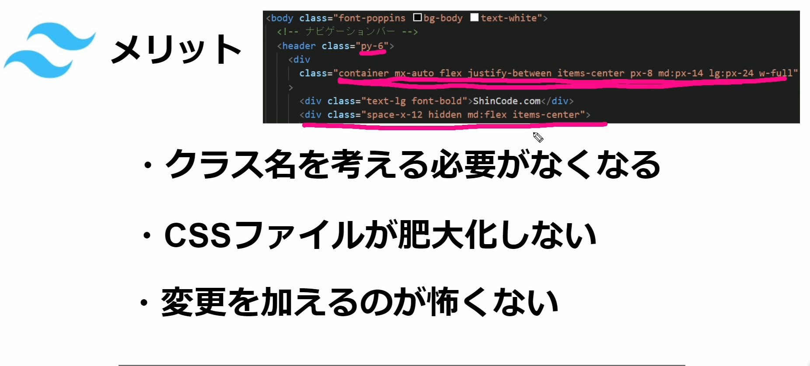
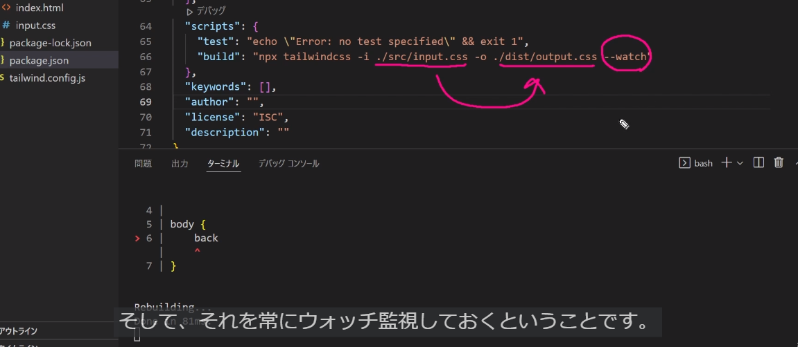
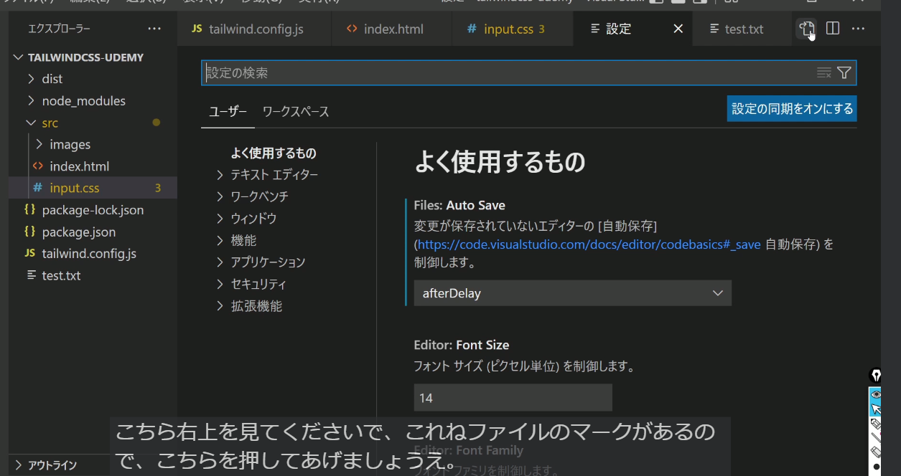

## Tailwindcssのメリット

- レスポンシブ対応
    例であげるとスマホやタブレットに対応する為に、本来は〇px以上からはこれを適用のように細かく設定しないといけないが、Tailwindcssはあらかじめブレイクポイントと呼ばれるものを使って簡単にレスポンシブ対応のウェブサイトが作れるようになる
- 繰り返し使うスタイルを抽出化
    多用するCSSを使いまわす事が出来る
- カスタマイズデザインが出来る



- クラス名を考える必要がなくなる
    本来であればclassnameにinputarea等の命名をし、そのclassnameにスタイルをあてるが、classに直書きできる為、名前を考える必要がなくなる
    ただ、プロジェクトが大きいものだったりするとどこになにがあるかがclassnameが無い為、わかりづらくなるデメリットもある
- cssファイルが肥大化しない
- 変更を加えるのが怖くない
    直接書いている為、どこに影響があるかがわかりやすい


## ひな形作成

https://tailwindcss.com/docs/installation
- 1.install
    npm installの-dは開発環境用で-gはどのプロジェクトでも使えるようにする
    ``` 
    npm install -D tailwindcss
    npx tailwindcss init
    ```
- 2.tailwind.config.js内を変更
    テンプレートのパスを構成する
    content = theme等のカスタマイズした内容をsrcディレクトリの中全てのファイルに適用させる
    ```
    content: ["./src/**/*.{html,js}"]
    ```
- 3.Tailwind ディレクティブを CSS に追加
    srcフォルダを作成しinput.cssを作成し下記を記述
    ```
    @tailwind base;
    @tailwind components;
    @tailwind utilities;
    ```
- 4.Tailwind CLI ビルド プロセスを開始する
    ```
    npx tailwindcss -i ./src/input.css -o ./src/output.css --watch
    ```
    npxが通らなかった為、yarnで対応
    package.json内のデバックに下記を記述すると"npm run build"で実行できる
    今回はnpxが通らない為yarn run buildで対応できる
    ```
     "scripts": {
        "test": "echo \"Error: no test specified\" && exit 1",
        "build":"npx tailwindcss -i ./src/input.css -o ./src/output.css --watch"
      },
    ```
    
    また--watchは状態が続いている場合は監視を続けますよという意味
    CSSに何か変更があった場合にすぐにビルドしますよということ
    Rebuilding...とは
    input.cssで記述されたcssが自動的にビルドされてoutput.cssに記述される
    

    input.css内に下記を記述していないとclass名でのcssを充てる事が出来なくなる
    ```
    @tailwind base;
    @tailwind components;
    @tailwind utilities;
    ```
    上記の@tailwindに波線が入っている場合プラグインをインストールする必要がある
    "PostCSS Language Support"をインストール
    上記のプラグインだと候補が出なくなるバグがある為、無効にし波線は無視する為の対応が下記になる
    

    settings.jsonに下記を追加
    ```
      "css.lint.unknownAtRules": "ignore"
    ```

    またtailwindcssを使用する際に下記のプラグインもインストールすると便利
    "Tailwind CSS IntelliSense"


- 5.htmlを作成
    srcフォルダにindex.htmlを作成し下記を記述
    !でタブ補完する必要がある
    ```
    <!DOCTYPE html>
    <html lang="ja">
    <head>
    <meta charset="UTF-8">
    <meta name="viewport" content="width=device-width, initial-scale=1.0">
    <link href="./output.css" rel="stylesheet">
    <title>ポートフォリオサイト</title>
    </head>
    <body>
    <h1 class="text-3xl font-bold underline">
        Hello world!
      </h1>
    </body>
    </html>
    ```