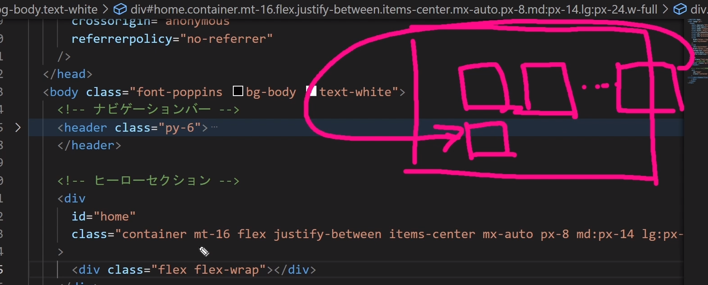
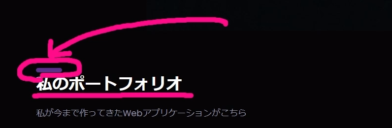
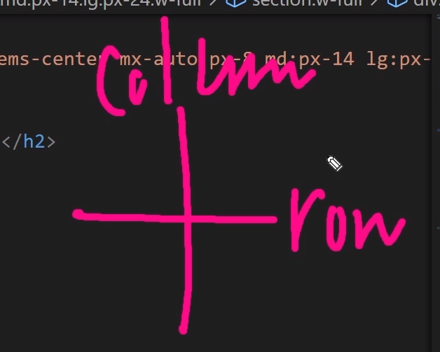
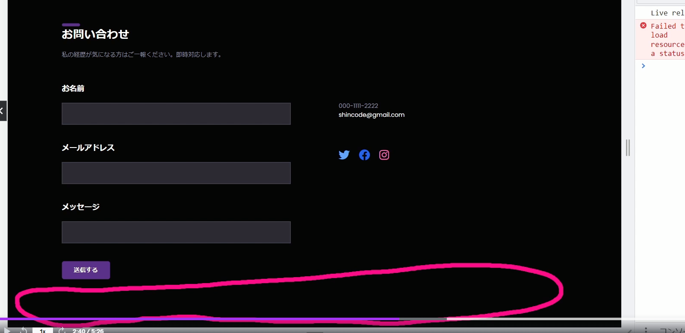

## ナビゲーションバー作成

## webサイトで使用するフォントの設定をしてみよう
- 1.Googleフォントの使用方法
    https://fonts.google.com/selection/embed
    使用したいフォントにチェックを入れ、<link>をhtmlのtitleの下にコピー
    ```
    <title>ポートフォリオサイト</title>
    <link rel="preconnect" href="https://fonts.googleapis.com">
    <link rel="preconnect" href="https://fonts.gstatic.com" crossorigin>
    <link href="https://fonts.googleapis.com/css2?family=Poppins:wght@300;400;500;600;700&display=swap" rel="stylesheet">
    ```
- 2.tailwind.config.js内に下記を記述
    ```
    module.exports = {
    content: ["./src/**/*.{html,js}"],
    theme:{
        extend:{},
        fontFamily:{
            poppins:["Poppins","sans-serif"],
        },
    },
    plugins:[],
    }
    ```
- 3.index.htmlのbodyタグにclass"font-poppins"を記述
    ```
    <body class="font-poppins">
        <h1 class="text-3xl font-bold underline">hello</h1>
    </body>
    ```
## サイトで使用する色をカスタマイズしてみよう
- 1.tailwind.config.jsにcolorsを設定する
    ```
    module.exports = {
    content: ["./src/**/*.{html,js}"],
    theme:{
        extend:{
            colors:{
                body:"050505",
            },
        },
        fontFamily:{
            poppins:["Poppins","sans-serif"],
        },
    },
    plugins:[],
    }
    ```
- 2.index.htmlに記述
    bg-bodyを記述
    ```
    <body class="font-poppins bg-body text-white">
        <h1 class="text-3xl font-bold underline">hello</h1>
    </body>
    ```

## ナビゲーションバーを作成
- 1.まずざっくりとした構成を下書きする
    ```
    <!-- ナビゲーションバー -->
    <header>
        <div>
            <div>ShinCode.com</div>
            <div>
                <a href="#home">ホーム</a>
                <a href="#home">ポートフォリオ</a>
                <a href="#home">お客様</a>
                <a href="#home"><button>お問い合わせ</button></a>
            </div>
        </div>
    </header>
    ```
- 2.cssをあてていく
    headerタグにpy-6を記述
    divタグにcontainer(要素の幅を現在のブレークポイントに固定するためのコンポーネント)を記述
    mx-autoにするとsm,md,lg,xl,2xlで自動で調整してくれる
    ```
    <!-- ナビゲーションバー -->
    <header class="py-6">
        <div class="container mx-auto">
            <div>ShinCode.com</div>
            <div>
                <a href="#home">ホーム</a>
                <a href="#portfolio">ポートフォリオ</a>
                <a href="#clients">お客様</a>
                <a href="#contact"><button>お問い合わせ</button></a>
            </div>
        </div>
    </header>

    ```
## Flexの意味を理解する
- 1.要素を横並びにする
    ```
    <!-- ナビゲーションバー -->
    <header class="py-6">
        <div class="container mx-auto flex">
            <div>ShinCode.com</div>
            <div>
                <a href="#home">ホーム</a>
                <a href="#portfolio">ポートフォリオ</a>
                <a href="#clients">お客様</a>
                <a href="#contact"><button>お問い合わせ</button></a>
            </div>
        </div>
    </header>
    ```
    flex化(横並びに)した要素の状態の時にjustfy-betweenを適用させる事が出来る
    flexがあたっていないとjustifyは使えない
    ```
    <div class="container mx-auto flex justify-between">
    ```
    要素の中心に横軸を揃える
    items-censter
    ```
    <div class="container mx-auto flex justify-between items-center">
    ```
    md:px-14 lg:px-24 ブレイクポイントを与える
    w-full ワイドを100％にする
    ```
     <div class="container mx-auto flex justify-between items-center px-8 md:px-14 lg:px-24 w-full">
    ```

## 要素間の間隔をあけてみよう
- 1.文字の大きさを変える
    text-lg text-3xl
    文字の太さを変える
    font-bold
- 2.リンクの幅を広げる
    aタグを囲んでいるdivタグにspace-x-12を適用
    左右の横幅を良い感じに調整してくれるプロパティ
    ```
    <div class="space-x-12">
        <a href="#home">ホーム</a>
        <a href="#portfolio">ポートフォリオ</a>
        <a href="#clients">お客様</a>
        <a href="#contact"><button>お問い合わせ</button></a>
    </div>
    ```
- 3.hoverしたら色変化
    カスタムプロパティ
    text-selected-text

    tailwind.config,js
    ```
            extend:{
            colors:{
                body:"#050505",
                "text-selected-text":"#A3A3FF"
            },
        },
    ```
    hoverした時にどのようなアニメーションを行うか指定する
    hoverする時にアニメーションをつける際はtransitionが必ずいる
    transition-all
    300ミリ秒(0.3秒)かけて変化させる
    duration-300
    ```
    <a href="#home" class="hover:text-selected-text transition-all duration-300">ホーム</a>
    ```
## お問い合わせのボタンを作成
- 1.カスタムプロパティを作成
    bg-theme
    ```
                colors:{
                body:"#050505",
                "text-selected-text":"#A3A3FF",
                theme:"5c318c"
            },
    ```
- 2.buttonタグにスタイルをあてる
    roundedは要素に丸みを帯びさせる
    ```
    <button 
    class="px-6 py-2 bg-theme font-bold rounded-lg hover:bg-purple-600 transition-all duration-300">お問い合わせ</button>
    ```
## ハンバーガーメニューを追加する
- 1.プロパティをあてる
    md:hiddenをあてるとmd(768px)より大きいときは消えている状態

- 2.参照
    https://cdnjs.com/libraries/font-awesome
    最新のタグをコピーしhtmlのlinkに貼りつける
    下記からlinkをコピーすることでfont-awesomeのアイコンが使えるようになる
    https://fontawesome.com/search?q=hamb&o=r

    ```
    <div class="md:hidden">
        <i class="fa-solid fa-bars"></i>
    </div>
    ```
- 3.アイコンを指定のpx以下で非表示にする
    aタグをまとめているdivタグに下記のプロパティを追加すると
    指定のpx以下になるとaタグが消えるようになる
    ```
    <div class="space-x-12 hidden md:flex items-center">
    ```

## ヒーローセクションの大枠から作成
- 1.主なタグを作成
    ```
    <div id="home" class="container mt-16 flex justify-between items-center mx-auto px-8 md:px-14 lg:px-24 w-full">
        <div class="flex flex-wrap md:flex-nowrap"></div>
    </div>
    ```
    flex-wrapとは
    flexで横幅いっぱいに要素で埋まったときにはみ出したものを折り返すプロパティ
    
- 2.タイトルとボタンを作成
    brは改行
    h1タグに文字のサイズ等を調整するプロパティを記述
    ```
    <div class="md:my-36">
        <h1 class="font-bold text-5xl text-center">
            TailWindCSSで <br />
            美しいサイトを<br />
            作ります
        </h1>
        <button class="px-6 py-4 bg-theme font-bold rounded-lg hover:bg-purple-600 transition-all duration-300 mt-10">
            <i class="fa-solid fa-rocket mr-1"></i>
            <span>もっと見る</span>
        </button>
    </div>
    ```
    ブラウザが大きくなると中央揃えから左揃えに変更する
    h1タグにmd:text-leftを追加
    文字のサイズを変更
    ```
    <h1 class="font-bold text-5xl text-center md:text-left lg:text-7xl md:text-6xl">
    ```
## 画像挿入
- 1.imgタグを挿入
    altは画像パスが通らなかった時に表示させるもの
    ```
            
    ```
    absoluteはポジションが絶対値で決められる
    top-2やbottomなどのプロパティはabsoluteを記述していないと記述できない
    ```
            
    
    ```
## レスポンシブレイアウトの修正
- 1.背景をレスポンシブに修正
    ```
    <div class="md:my-36 lg:ml-20 justify-center md:justify-start mx-auto max-w-xl">

## portfolioセクション
- 1.準備
    divタグを準備
    secondary-titleというカスタムプロパティを作成
    index.cssにてカスタムプロパティに記述していく

    ```
        <div id="portfolio" class="container mt-64 flex justify-between items-center mx-auto px-8 md:px-14 lg:px-24 w-full">
        <section class="w-full">
            <h2 class="secondary-title">私のポートフォリオ</h2>
        </section>
    ```
    @applyは適用していきますよというプロパティ
    ::beforeは疑似要素となる
    簡潔に言えば、要素の手前に何かをつけるという意味
    疑似要素を使う場合はコンテントの空(content:"")を用意する必要がある
    ```
    index.css
    .secondary-title{
    @apply text-3xl font-bold;
    }
    .secondary-title::before{
    content:"";
    @apply block w-12 h-2 bg-theme rounded-full mb-1;
    }
    ```
    
- 2.pタグを作成
    section-paragraphはカスタムプロパティ
    ```
    <p class="section-paragraph">私が作ってきたWebアプリケーションがこちら</p>
    ```
    input.cssにて
    ```
    .section-paragraph{
    @apply text-secondary my-6 w-full max-w-3xl;}
    ```
    text-secondaryというプロパティは無い為、configにてsecondaryを指定する
    tailwind.config.jsにて
    ```
                colors:{
                body:"#050505",
                "text-selected-text":"#A3A3FF",
                theme:"#5c318c",
                secondary:"#9191A4"
            },
    ```
## 画像をグリッドレイアウトを使ってグリッド表示させる
- 1.divタグを作成
    class名をgridとし
    imgタグを展開
    object-coverは画像の画質をよくする為に頻繁に使うプロパティ
    grid-colsは展開する画像の列の数
    gap-6はgridの子要素の配列を24px間隔をあける事が出来る
    ```
    <div class="grid lg:grid-cols-3">
    
    同様のimgタグを5つ複製
    </div>
    ```
    縦がcolsで横がrow
    

## スキルアピールできるセクションを作成しよう
- 1.大枠とスキルのロゴをfont～から取得
    ```
            <div id="portfolio" class="container mt-64 flex justify-between items-center mx-auto px-8 md:px-14 lg:px-24 w-full">
            <section class="w-full">
                <h2 class="secondary-title">スキルスタック</h2>
                <p class="section-paragraph">私は以下のプログラミング言語を１０年以上扱ってきました</p>
                <div class="my-16">
                    <div class="w-full border border-purple-300">
                        <!-- 言語のロゴ -->
                        <div>
                            <i class="fa-brands fa-square-js text-7xl text-yellow-300"></i>
                        </div>
                    </div>
                </div>
            </section>
        </div>
    ```
- 2.保有するスキルを説明するセクションを作成
    ```
        <div id="portfolio" class="container mt-64 flex justify-between items-center mx-auto px-8 md:px-14 lg:px-24 w-full">
            <section class="w-full">
                <h2 class="secondary-title">スキルスタック</h2>
                <p class="section-paragraph">私は以下のプログラミング言語を１０年以上扱ってきました</p>
                <div class="my-16">
                    <div class="w-full border border-purple-300 p-16 lg:px-32 lg:py-20 flex justify-center lg:justify-start flex-wrap space-x-12">
                        <!-- 言語のロゴ -->
                        <div>
                            <i class="fa-brands fa-square-js text-7xl text-yellow-300"></i>
                        </div>
                        <!-- スキルの説明 -->
                        <div>
                            <h3 class="text-3xl font-semibold">Javascript</h3>
                            <div>
                            <div>ウェブサイト制作</div>
                            <div>フロントエンド制作</div>
                            </div>
                            <p>javascriptエンジニア。普段をReactを使って開発現場で働いています</p>
                        </div>
                    </div>

                </div>
            </section>
        </div>
    ```

## 文字にバッジをつける
- 1.カスタムプロパティbadgeを作成している

    ```
                            <div>
                            <h3 class="text-3xl font-semibold">Javascript</h3>
                            <div class="flex flex-wrap w-full justify-center gap-3 lg:w-auto lg:justify-start mt-6 mb-8">
                                <div class="badge">ウェブサイト制作</div>
                                <div class="badge">フロントエンド制作</div>
                            </div>
                            <p>javascriptエンジニア。普段をReactを使って開発現場で働いています</p>
                        </div>
    ```

## レスポンシブに対応
    space-x-32というプロパティがどの画面サイズでも適用される状態になっている為訂正
    ```
                    <div class="w-full border border-purple-300 p-16 lg:px-32 lg:py-20 flex justify-center lg:justify-start flex-wrap lg:space-x-32">
    
    ```
## スキル一覧を複製
- 1.スキル一覧を複製し各所訂正を行う

## お問い合わせフォームを作成
- 1.gridを使って表現する
    lg:grid-cols-2は画面を真ん中で分割し表示するプロパティ
    ```
            <div id="contact" class="container mt-64 flex justify-between items-center mx-auto px-8 md:px-14 lg:px-24 w-full">
            <section class="w-full">
                <h2 class="secondary-title">お問い合わせ</h2>
                <p class="section-paragraph">私の経歴が気になる方はご一報ください</p>
                <div class="w-full grid lg:grid-cols-2 gap-8 lg:gap-32 mt-16">
                    <div>
                        <div>
                            <label class="text-white block mb-6 text-xl font-bold">お名前</label>
                            <input type="text" class="w-full border border-inputBorder bg-input px-4 py-4">
                        </div>
                    </div>
                </div>

            </section>
        </div>
    ```
    space-y-12はmargin-topとmargin-bottomを子要素に対して一つ一つあてることができる
    ```
    <div class="space-y-12">
    ```

## 画面下部の余白の付け方

    
    プロパティmt-52 mb-20が余白を与えているプロパティ
    ```
    <div id="contact" class="container mt-52 mb-20 flex justify-between items-center mx-auto px-8 md:px-14 lg:px-24 w-full"></div>
    ```
## SNS情報を追加しよう
    ```
                           <div class="mt-20 space-x-6">
                            <a href="#">
                                <i class="fa-brands fa-twitter text-3xl text-blue-400"></i>
                            </a>
                            <a href="#">
                                <i class="fa-brands fa-facebook text-3xl text-blue-600"></i>
                            </a>
                            <a href="#">
                                <i class="fa-brands fa-instagram text-3xl text-pink-400"></i>
                            </a>
                        </div>
    ```

## 各セクションに移動するのをスムーズにする
    inputcssにて下記を記述
    ```
    html,
    body{
    scroll-behavior: smooth;
    }
    ```

