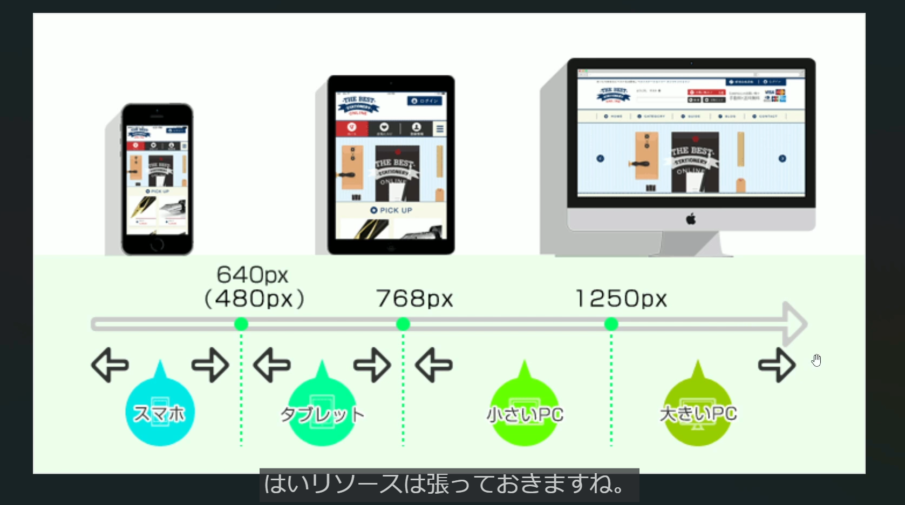
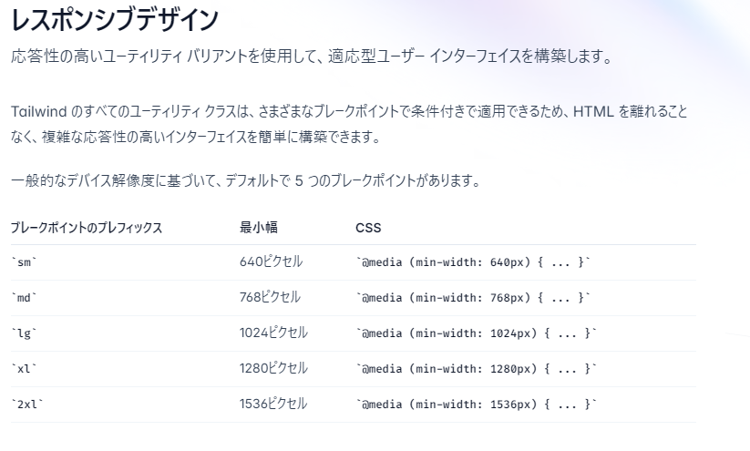
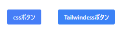

## tailwindcssの基礎
https://tailwindcss.com/docs/font-size
検索からcssのプロパティを選択し記述する
- 1.文字の大きさや色を変える
    例
    ```
    <h1 class="text-7xl font-bold">TailwindCSS入門</h1>
    ```
    適用内容
    ```
    .text-7xl {
    font-size: 4.5rem/* 72px */;
    line-height: 1;
    }

    .font-bold {
    font-weight: 700;
    }
    ```
## paddingとmargin
- paddingとは要素の内側の余白のこと
    上下の余白 = py
    左右の余白 = px
    上下左右の余白 = p
- marginは要素の外側の余白のこと
    上下の余白 = my
    左右の余白 = mx
    上下左右の余白 = m

## ブレイクポイントを理解してレスポンシブ対応を学ぼう


本来のcssでは@media(メディアクエリ)を学ばないと実装出来ないがTailWindcssではブレイクポイントにおけるレスポンシブのデザインを簡単に実装する事が出来るutilityというものが準備してある
smやlgをあてたいcssの先頭に付ける(プレフィックス)とその指定のサイズ以上の場合に適用される
- テキストをレスポンシブに表示させる
    下記の記述はlg(1024px)の幅以上になった時にテキストを7xlで表示する
    1024px以下の場合は3xlで表示する
    ```
    <h1 class="lg:text-7xl font-bold text-3xl">TailwindCSS入門</h1>
    ```

## ボタンを比較
通常のｃｓｓ
```
    .easy-button{
    padding: 8px 16px;
    background-color: #467ef7;
    color:white;
    border-radius: 4px;
    font:bold;
    margin-left: 40px;
    }
    .easy-button:hover{
    background-color: #386bd8;
    }
```
Tailwindcss
```
    <button
    class="bg-blue-500 hover:bg-blue-600 text-white font-bold py-2 px-4 rounded ml-10">
        Tailwindcssボタン
    </button>
```
下記のようなボタンを作れる


## 繰り返し使うスタイルを抽出化
- 1.input.cssに使いまわしたいcssを記述
```
.btn{
    @apply font-bold py-2 px-4 rounded ml-10
}

.btn-blue{
    @apply bg-blue-500 text-white
}
.btn-blue:hover{
    @apply bg-blue-600
}
```
- 2.index.htmlにてボタンのclassに上記で作成したクラス名を記述
```
        <button
         class="btn-blue btn">
            Tailwindcssボタン
        </button>
```
これだけで使いまわしたいcssを作成する事が出来る

## カスタマイズデザインを実装
- 1.tailwind.config.jsにてextendの中に記述
    使用例としては、ボタンの色が100、200と固定された色しか出てこない為、もうちょっとこだわりたい時に事前に設定をする事が出来る
    色を設定する為、colorsは固定でprimaryは好きな名前を入れてよい
    ```
    module.exports = {
    content: ["./src/**/*.{html,js}"],
    theme:{
        extend:{
            colors:{
                primary:{
                    100:"#ebf8ff",
                    300:"#90cdf4",
                    500:"#4299e1",
                }
            }
        },
    },
    plugins:[],
    }
    ```
- 2.index.htmlに記述
    bg-[カスタマイズ名]-300や500と記述するだけで使えるようになる
    ```
    <button
    class="btn bg-primary-300">
    Tailwindcssボタン
    </button>
    ```
